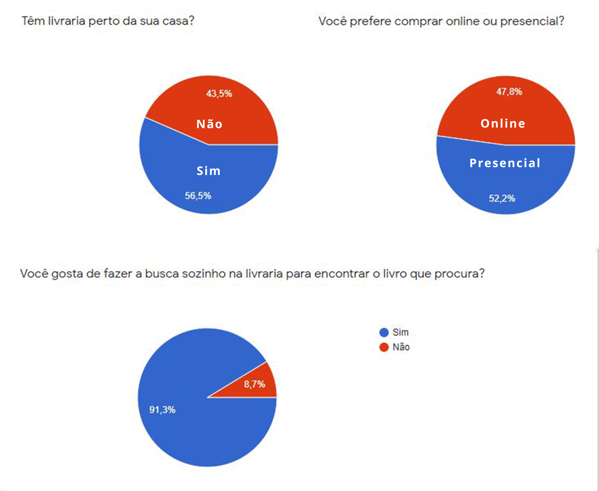
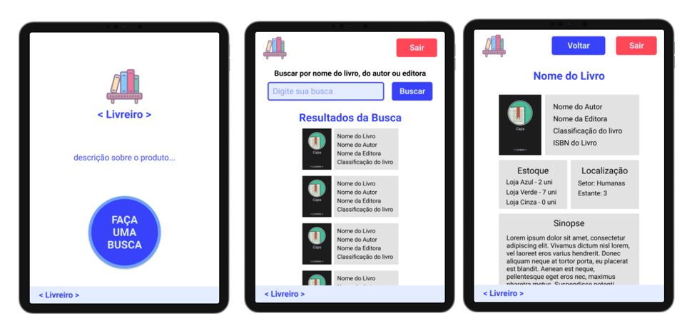

# Livreiro

<b> *Acesse a aplicação [Aqui](https://livreiro.vercel.app/) 
## Índice

- [1. Introdução](#1-introdução)
- [2. Resumo do projeto](#2-resumo-do-projeto)
- [3. Personas](#3-personas)
- [4. Pesquisa](#4-pesquisa)
- [5. Funcionalidades](#5-funcionalidades)
- [6. Protótipos](#6-protótipos)
- [. Desenvolvido por](#-desenvolvido-por)

---

## 1. Introdução

Esse projeto foi proposto pela Laboratoria, com o objetivo de desenvolver um produto no ramo de entreterimento utilizando APIs.
O Livreiro foi o produto desenvolvido durante os dois dias de Hackathon.

## 2. Resumo do projeto

Fazendo uma pesquisa voltada ao mercado de livros, mapeamos um problema em comum no que diz respeito a experiência dos frequentadores de livrarias, que alegam  a falta  de autonomia para encontrar as informações referente ao produto que procura, e também a demora no atendimento presencial.

Sendo assim direcionamos nossa solução para as  livrarias, e desenvolvemos o assistente virtual Livreiro, onde o cliente poderá pesquisar informações de forma direta e a disponibilidade dos produtos  na loja e onde encontra-lo.

### 3. Pesquisa
Um breve trecho da pesquisa desenvolvida:

### 4. Personas

Após a pesquisa com o formulário formulamos uma protopersona e 4 personas de possíveis usuários:

### 5.Funcionalidades
- Atendimento Personalizado
- Pesquisar por autor, nome do livro, editora e ISBM
- Verificar a disponibilidade dos livros desejados
- Localizar o setor no qual se encontra o livro

### 6. Protótipos

### .Desenvolvido por:
*[Ana Beatriz](https://github.com/biacostadev)  
*[Karina](https://github.com/karina1602)
*[Kaueny Alves](https://github.com/Kaueny-Alves)
*[Gabrielle Almeida](https://github.com/GabrielleAlmeida)
*[Gabriella Guimarães](https://github.com/gabriella-guimaraes)
*[Tânagra Andria](https://github.com/TanagraAndria)
